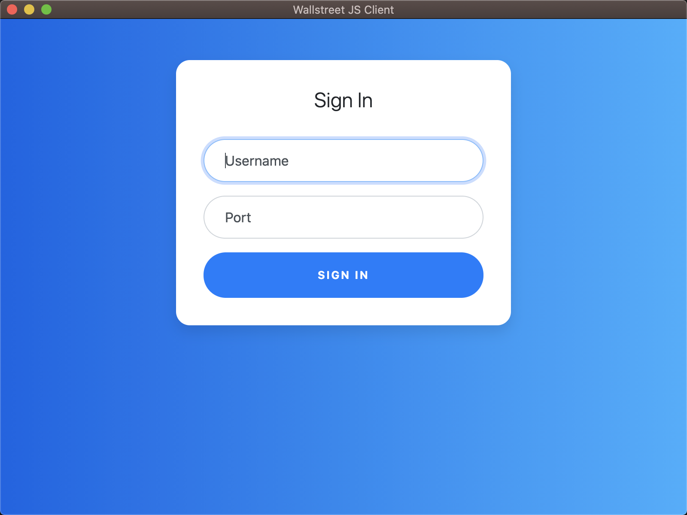

# wallstreet
[](https://github.com/made-in-indonesia/made-in-indonesia)
[](https://travis-ci.org/empeje/wallstreet)

Wallstreet is a websocket app



## Prerequisites for Development

1. Docker Installed (If not in Linux environment)
2. Node & NPM

## Setup Development Environment

1. Start the websocket server

```bash
# In Linux
yarn start:ws

# In non-Linux using Docker
yarn start:ws:docker
```

2. Yarn local setup

```bash
yarn start # this is the JS version

env RUNTIME=elm yarn start # this is the Elm version
```
